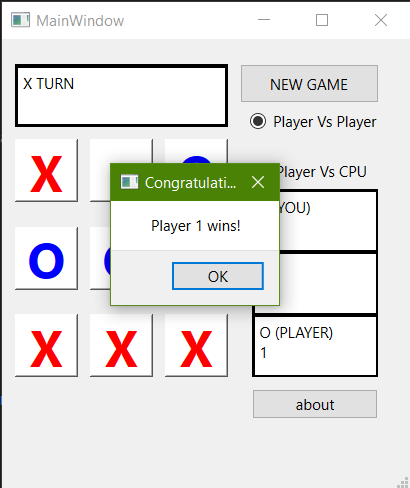

# Tic Tac Toe

## the  famous game in which two people can compete against each other to win or it can be against CPU.

At each turn one player must choose an empty space to put his/her mark **(showed as X & O)** in order to compelete a full column or row or diagonally so as to win.

---

