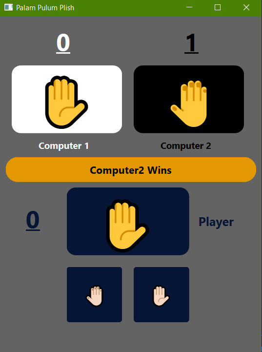
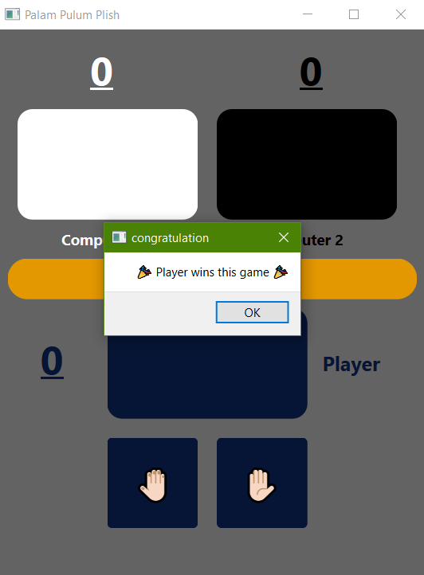

# Palam Pooloom Pilich

It`s a game in which you must choose "Front" or "Back", the other two players which here they are copmuters choose too, and the one who is different from the two others wins.
If all three players choose the same side, It`s a tie.

The game continues till one player reach 5 in the scorings.

