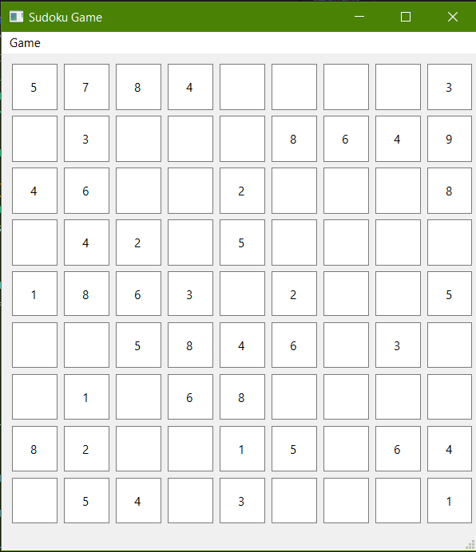
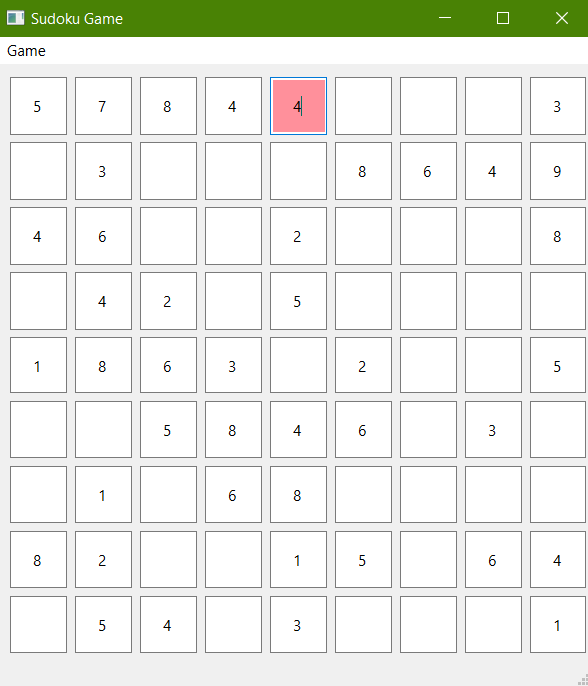

# Sudoku game

In classic Sudoku, the objective is to fill a 9 × 9 grid with digits so that each column, each row, and each of the nine 3 × 3 subgrids that compose the grid (also called "boxes", "blocks", or "regions") contains all of the digits from 1 to 9. The puzzle setter provides a partially completed grid, which for a well-posed puzzle has a single solution.

---

If there is an error with the number you entered, you will see that the corresponding cell will turn red.

---
You can play the game by running "main.py"

ENJOY!