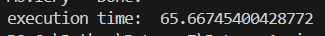
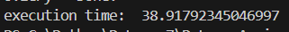

# Video To Audio Convertor

It is a simple code which you can convert a video file(mp4) to an audio file(mp3).

## Main Objective
To compare execution time in Convertor.py and ConvertorPro.py, which in Pro version I'm using Threading to convert video files.

Below you can see the result
---

execution time in Convertor.py

execution time in ConvertorPro.py

---

As you can see there is difference, by using Threading you can save more time and maybe more life!
